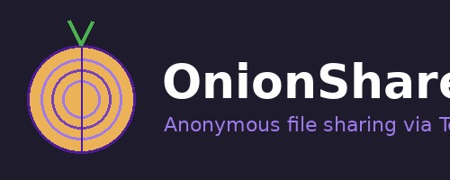

# OnionShare — Home Assistant Add-on

A Home Assistant add-on that brings [OnionShare](https://onionshare.org/) to Home Assistant OS:
**share files, receive uploads, host static websites and chat anonymously** — all over Tor hidden services.

  

## Features

- 📤 **Share mode** — upload files/folders, get a `.onion` URL
- 📥 **Receive mode** — anyone with the link drops files into `/share/onionshare-uploads`
- 🌐 **Website mode** — serve a static-site folder anonymously
- 💬 **Chat mode** — ephemeral anonymous chat rooms
- 🗂️ Browse `/share`, `/media` (incl. EasyNas mounts), `/backup`, `/config`
- 🔒 Persistent onion addresses (optional)
- 🌉 Tor bridge support (for use behind censorship)
- 🌙 Dark themed Flask UI behind HA Ingress
- 🦺 Tor runs as **client-only** — no relay, no exit-node, no inbound traffic

## Install

Or manually:

1. In Home Assistant: **Settings → Add-ons → Add-on Store → ⋮ → Repositories**
2. Paste: `https://github.com/gregorwolf1973/onionshare-addon`
3. Install the **OnionShare** add-on that appears.
4. Start it. First boot takes 60–120 s while Tor bootstraps.
5. Open the **OnionShare** sidebar panel.

## How to access `.onion` URLs

`.onion` addresses **only work in the [Tor Browser](https://www.torproject.org/download/)**
(or [Onion Browser](https://onionbrowser.com/) on iOS, [Tor Browser for Android](https://play.google.com/store/apps/details?id=org.torproject.torbrowser)).
Normal browsers like Chrome or Firefox cannot resolve `.onion` — that's by design.

For private sessions, the recipient also needs the **Private key** shown next to the URL.
Check **Public** if you want a key-less link.

## Documentation

See [`onionshare/README.md`](onionshare/README.md) for the full add-on docs, configuration
options, and architectural notes (process management, Tor integration, persistent onions,
HA Ingress, path safety, etc.).

## Support

If this add-on saves you time, consider buying me a coffee:

## License

MIT — see [LICENSE](LICENSE).

OnionShare itself is © Micah Lee and contributors, also MIT-licensed.
This repository only packages it for Home Assistant — it does not include OnionShare's source.
